# 🏴‍☠️ Buddy Battle

<div align="center">


### *Ye Pirate Mates Battle for Gold and Glory!* ⚔️

**Turn decision-making into a swashbuckling adventure. Win battles, earn gold, and sway the final decision!**

[Features](#-features) • [How It Works](#-how-it-works) • [Games](#-mini-games) • [Getting Started](#-getting-started) • [Tech Stack](#-tech-stack)

</div>

---

## 🌟 The Story Behind Buddy Battle

Ever spent 30 minutes debating what movie to watch? Or where to eat? Or what game to play next?

**We've all been there.** That's why Buddy Battle exists — to transform those never-ending discussions into competitive, pirate-themed mini-games where winners earn gold and influence the final decision!

You and your pirate mates battle it out through various challenges. The more you win, the more sway you have over the final choice. May the best pirate win! 🏴‍☠️

> 💡 Born at **Atlassian X UNIHACK 2025**, this project started as a hackathon submission and is now evolving into something even bigger!

---

## ✨ Features

<table>
<tr>
<td width="50%">

### 🎲 Pirate-Themed Competition
Turn boring debates into exciting pirate battles where skill and luck determine who gets the gold!

</td>
<td width="50%">

### 👥 Multiplayer Ready
Real-time multiplayer with chat rooms - everyone plays together, everyone sees the action!

</td>
</tr>
<tr>
<td width="50%">

### 💰 Gold & Influence System
Winners earn gold and gain more sway over the final decision. Battle your way to victory!

</td>
<td width="50%">

### 🕹️ Multiple Mini-Games
Hangman, word unscramble, puzzle slider, and more swashbuckling challenges!

</td>
</tr>
</table>

---

## 🎮 How It Works

```mermaid
graph LR
    A[🏴‍☠️ Join Crew] --> B[⚓ Add  Options]
    B --> C[⚔️ Battle in Mini-Games]
    C --> D{🏆 Winner?}
    D --> E[💰 Earn Gold]
    E --> F{📊 Final Vote?}
    F -->|No| C
    F -->|Yes| G[🎉 Decision Made!]
```



1. **Join the Crew** - Create or join a pirate crew (game room)
2. **Add Activity Options** - Everyone suggests what they want to do in a chat
3. **Battle in Mini-Games** - Compete in pirate-themed challenges
4. **Earn Gold** - Winners collect gold for each victory
5. **Gain Influence** - More gold = more sway in the final decision
6. **Make the Choice** - The crew decides based on battle performance! 🏴‍☠️

---

## 🕹️ Mini-Games

### 🔤 Pirate Hangman
Classic word-guessing game with a pirate twist. Save your matey from walking the plank!

### 🔀 Treasure Map Unscramble
Race against your crew to unscramble jumbled words and find the treasure!

### 🧩 Island Puzzle Slider
Slide tiles to complete the tropical island picture before anyone else. Strategy meets speed!

### 🎲 More Adventures Coming Soon...
I will be constantly adding new challenges to keep the high seas exciting!

---

## 🚀 Getting Started

### Prerequisites
- Python 3.7+
- pip

### Installation

```bash
# Clone the repository
git clone https://github.com/fig-fig/buddybattle.git

# Navigate to the project directory
cd buddybattle

# Install dependencies
pip install -r requirements.txt

# Run the application
python app.py
```

### Usage

1. Open your browser and navigate to `http://localhost:5000` (will be deployed soon)
2. Create a new pirate crew or join an existing one
3. Wait for your mates to join the adventure
4. Add activities to choose from
5. Battle for gold and glory! ⚔️

---

## 🛠️ Tech Stack

<div align="center">

| Technology | Purpose |
|------------|---------|
| **Python (98.9%)** | Backend logic and game mechanics |
| **Flask** | Web framework for routing and multiplayer |
| **HTML (0.3%)** | Frontend structure |
| **CSS (0.2%)** | Pirate-themed styling and animations |
| **JavaScript (0.1%)** | Interactive game elements |
| **Flask-SocketIO** | Real-time multiplayer connectivity |

</div>

---

## 🎯 Development Journey

### 💪 Challenges Overcome

- **Multiplayer Connectivity**: Implemented real-time chat rooms and game synchronisation
- **State Management**: Ensured all players see the correct game state at all times
- **Game Transitions**: Created smooth flows between different mini-games
- **Pirate Theme**: Designed an engaging pirate aesthetic with custom graphics
- **Player-Specific Views**: Made sure players only see content relevant to their current state

### 📚 What We Learned

- Flask web application development from scratch
- Real-time multiplayer game architecture
- State synchronisation across multiple clients
- Building engaging, themed user experiences
- Socket-based communication for live gameplay

### 🏆 Proud Moments

- Stepped completely out of our Data Science & AI comfort zone
- Built a fully functional multiplayer web game
- Created a unique pirate theme that makes decision-making fun!
- Successfully implemented real-time game state synchronisation

---

## 🎨 Assets & Credits

This project uses various pirate-themed images and assets:

- **Tropical Island Background**: [Freepik - Tropical Paradise Beach](https://www.freepik.com/free-vector/tropical-paradise-beach-oasis_145857487.htm)
- **Pirate Battle Scene**: [Vecteezy - Cartoon Pirates Fighting](https://static.vecteezy.com/system/resources/previews/039/613/259/non_2x/two-cartoon-pirate-corsairs-fighting-on-sabers-vector.jpg)
- **Treasure Map**: [PNGWing - Treasure Map](https://w7.pngwing.com/pngs/205/282/png-transparent-treasure-map-piracy-buried-treasure-painting-and-calligraphy-box-decoration-border-jolly-roger-road-map.png)
- **Hangman Graphics**: [Tumblr - Hangman](https://www.tumblr.com/thecityofregalia/94905917024/hangman)

---

## 🗺️ Roadmap

- [ ] Add more pirate-themed mini-games (Cannon Battle, Ship Racing, Treasure Hunt)
- [ ] Implement player profiles with pirate avatars
- [ ] Add achievement system (Pirate Ranks & Titles)
- [ ] Create customisable game settings (difficulty, time limits)
- [ ] Mobile-responsive design improvements
- [ ] Add sound effects and shanty music
- [ ] Create tournament mode for larger crews
- [ ] Leaderboard system to track the greatest pirates

---

## 🤝 Contributing

Ahoy! Contributions are welcome, matey! Feel free to:

- 🐛 Report bugs
- 💡 Suggest new mini-games or features
- 🔧 Submit pull requests
- ⭐ Star the repo if you like it!

---

## 📜 License

This project is open source.
Images used:

- https://www.freepik.com/free-vector/tropical-paradise-beach-oasis_145857487.htm#fromView=search&page=1&position=34&uuid=fde35267-fd2c-4467-b174-71517b2efaa2&query=cartoon+island
- https://static.vecteezy.com/system/resources/previews/039/613/259/non_2x/two-cartoon-pirate-corsairs-fighting-on-sabers-vector.jpg
- https://w7.pngwing.com/pngs/205/282/png-transparent-treasure-map-piracy-buried-treasure-painting-and-calligraphy-box-decoration-border-jolly-roger-road-map.png
- https://www.tumblr.com/thecityofregalia/94905917024/hangman

---
<div align="center">

### 👥 Original Crew

This project was built by a team of 2 developers and presented by 2 additional team members during UNIHACK 2025.

### 🔗 Original Hackathon Repository

This project was originally created for the **Atlassian X UNIHACK 2025** hackathon.  
Check out the original repository: [Buddy-Battle](https://github.com/fgeo0003/buddybattle)

And our submission page: [Buddy Battle @ UNIHACK 2025](https://devpost.com/software/buddy-battle#updates) 

This repo continues development from the original hackathon submission. The project is now being maintained and expanded with new features and improvements.

---


## 🎉 Acknowledgments

Special thanks to **Atlassian X UNIHACK 2025** for providing the platform where this idea came to life!

---


**Made with ❤️ and competitive pirate spirit**

*Let the battles decide! May the best pirate win!* 🏴‍☠️⚔️

</div>
